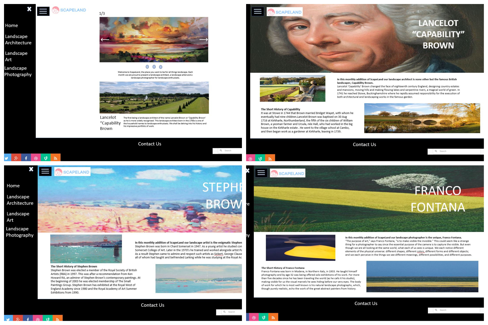

# ScapeLand

This is a website created independently in my first-year computer science degree with no prior knowledge of web design and development. It uses HTML5, CSS3 and JavaScript. Go to https://haalasudi.github.io/ScapeLand/ to see the website!

Below is my design plan before creating the website.

